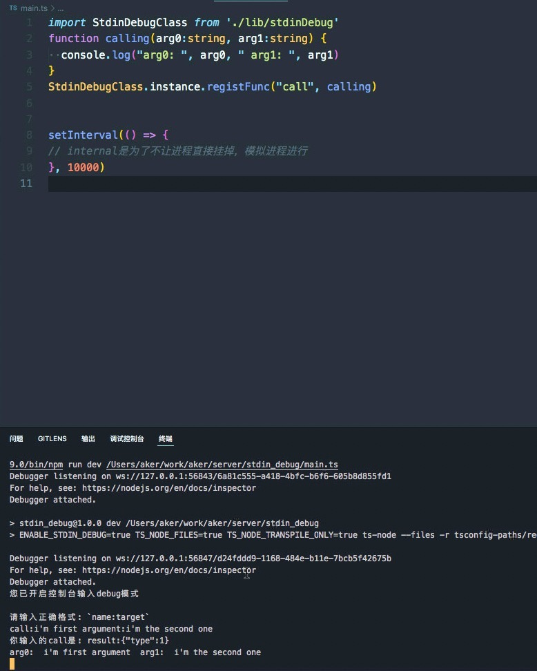

# stdinDebug

nodejs 启动后调试不方便？试试stdinDebug。您要做的是`注册`，然后随时在控制台调用已注册的方法。如:

```ts
// 环境变量ENABLE_STDIN_DEBUG=true 启动该功能
import StdinDebugClass from './lib/stdinDebug'
function calling(arg0:string, arg1:string) {
  console.log("arg0: ", arg0, " arg1: ", arg1)
}
StdinDebugClass.instance.registFunc("call", calling)
```

启动后，您只需在控制台输入`call:1:2` 即可帮助您调用。

## 测试

    cp .vscode/launch.example.json .vscode/launch.json && npm i
    node run dev #或者按下F5键 进入断点模式

## 使用

环境变量启动该功能: `ENABLE_STDIN_DEBUG=true`

保证 `process.env.ENABLE_STDIN_DEBUG` 有值即可启动。

    StdinDebugClass.instance.registFunc("call", calling) // 控制台调用已注册calling 方法

    StdinDebugClass.instance.registObject("obj_in_memory", obj) // 打印某个obj对象

## 示例



